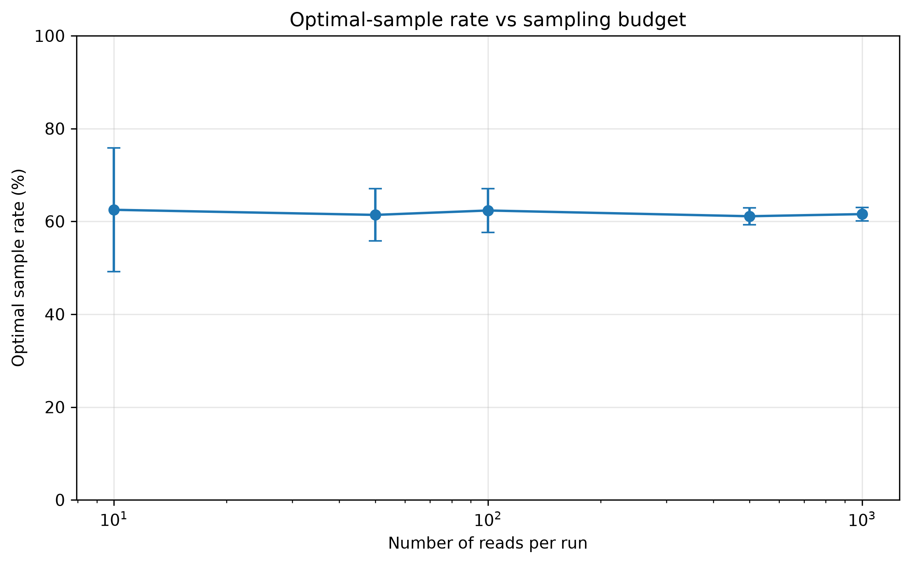
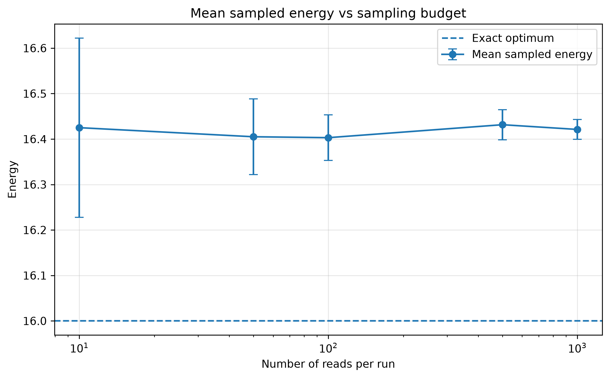
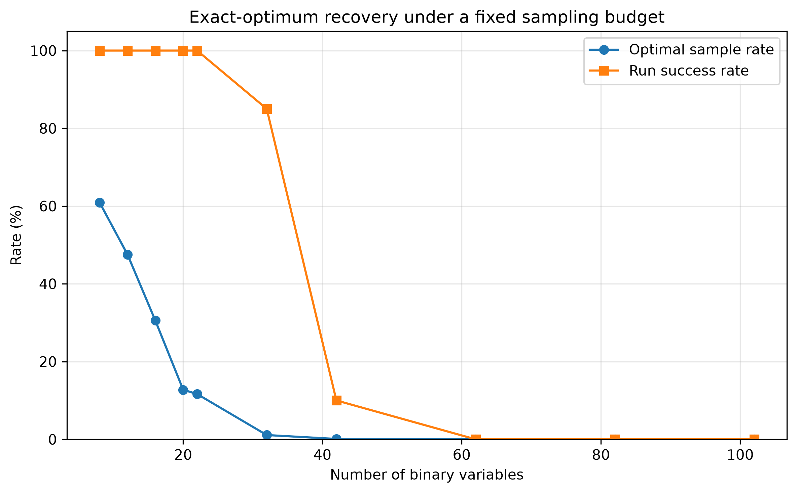
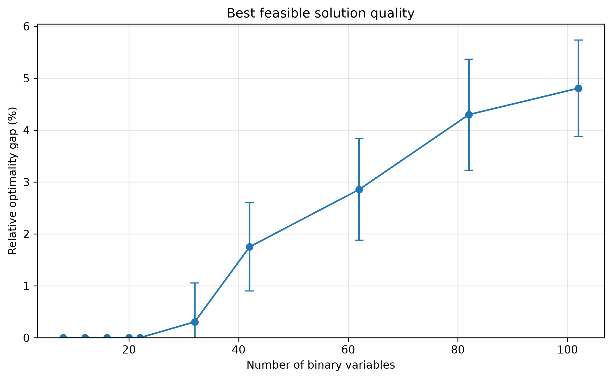
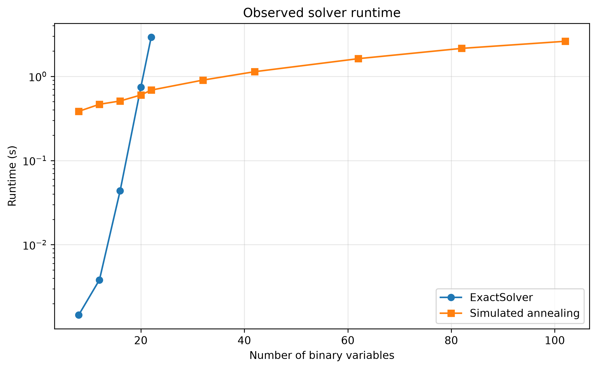

# QUBO Facility Location

A small but fully validated implementation of the **Uncapacitated Facility Location Problem (UFLP)** as a Binary Quadratic Model (BQM).

The project demonstrates an end-to-end workflow for translating a constrained optimization problem into a QUBO-compatible formulation, validating the encoding independently, solving it with exact and annealing-based methods, and studying how solution quality evolves with problem size and sampling budget.

## Overview

Given a set of candidate facilities and clients, the objective is to decide:

- which facilities should be opened;
- which facility should serve each client;

while minimizing opening and assignment costs.

The project follows the workflow:

```text
Problem definition
       ↓
Binary variables
       ↓
Cost function + constraint penalties
       ↓
QUBO / BQM
       ↓
Exact validation
       ↓
Simulated annealing
       ↓
Penalty analysis
       ↓
Sampling-budget analysis
       ↓
Scalability analysis
```

The implementation uses **PyQUBO** to construct the symbolic Hamiltonian and **dimod** to represent the resulting Binary Quadratic Model.

---

## Mathematical formulation

Let:

- $x_{ij} \in \{0,1\}$ indicate whether client $i$ is assigned to facility $j$;
- $y_j \in \{0,1\}$ indicate whether facility $j$ is open;
- $c_{ij}$ be the cost of assigning client $i$ to facility $j$;
- $f_j$ be the cost of opening facility $j$.

The economic objective is

$$
C(x,y) = \sum_j f_j y_j + \sum_i \sum_j c_{ij} x_{ij}
$$

### Assignment constraint

Each client must be assigned to exactly one facility:

$$
\sum_j x_{ij} = 1 \quad \forall i
$$

This constraint is encoded using the quadratic penalty

$$
P_{\mathrm{assignment}}
=
\lambda_a
\sum_i
\left(
\sum_j x_{ij} - 1
\right)^2
$$

where $\lambda_a$ controls the strength of the assignment penalty.

### Open-facility constraint

A client can only be assigned to an open facility:

$$
x_{ij} \leq y_j
$$

For binary variables, a convenient quadratic penalty is

$$
P_{\mathrm{open}}
=
\lambda_o
\sum_{i,j}
x_{ij}(1-y_j)
$$

where $\lambda_o$ controls the strength of the open-facility penalty.

### Complete Hamiltonian

The complete QUBO Hamiltonian is

$$
H
=
C
+
P_{\mathrm{assignment}}
+
P_{\mathrm{open}}
$$

For feasible solutions, both penalty terms vanish and therefore $H=C$.

---

## Reference instance

The base validation problem contains three clients and two candidate facilities.

### Opening costs

| Facility | Cost |
|---|---:|
| A | 8 |
| B | 6 |

### Assignment costs

| Client | A | B |
|---|---:|---:|
| 1 | 2 | 5 |
| 2 | 3 | 2 |
| 3 | 4 | 3 |

The optimal feasible solution is to open only facility B and assign all clients to it.

Its economic cost is

$$
C^* = 6 + 5 + 2 + 3 = 16
$$

The corresponding BQM contains **8 binary variables**:

- 2 facility-opening variables;
- 6 client-assignment variables.

---

## Independent validation

The QUBO formulation is not used to validate itself.

Candidate solutions are checked independently against the constraints of the original optimization problem:

1. every client must be assigned exactly once;
2. every facility receiving an assignment must be open.

For small instances, `dimod.ExactSolver` exhaustively evaluates the binary state space and provides a ground-truth reference.

For the base instance:

```text
Optimal energy: 16
Feasible: True
```

This agrees with the analytically known optimum $C^*=16$.

Independent constraint validation is important because obtaining the minimum of a QUBO does not, by itself, prove that the QUBO correctly represents the original constrained problem.

---

## Penalty-strength analysis

Penalty coefficients must be sufficiently large to make constraint violations energetically unattractive.

However, unnecessarily large penalties can increase the coefficient range of the QUBO and may be undesirable for finite-precision or hardware-constrained optimization.

The project therefore analyzes the feasibility of the ground state as the penalty strengths are varied.

### Open-facility penalty

With the assignment penalty fixed at $\lambda_a=10$, the reference instance requires

$$
\lambda_o > 3
$$

for all ground states to be feasible.

At exactly $\lambda_o=3$, feasible and infeasible ground states become degenerate.

### Assignment penalty

With the open-facility penalty fixed at $\lambda_o=10$, the corresponding threshold is

$$
\lambda_a > \frac{16}{3}
$$

Again, equality produces degeneracy between feasible and infeasible ground states.

The experiments use

$$
\lambda_a = \lambda_o = 10
$$

which provides a comfortable margin for the tested benchmark instances.

These thresholds are properties of the tested formulation and instance. They should not be interpreted as universal penalty values for arbitrary facility-location problems.

---

## Simulated annealing

The BQM is also solved using `neal.SimulatedAnnealingSampler`.

Because simulated annealing is stochastic, the experiments distinguish between individual **reads** and independent **runs**.

A read corresponds to one sampled solution.

A run corresponds to one complete sampler call containing a specified number of reads.

Two quantities are particularly useful.

### Optimal sample rate

The optimal sample rate is the fraction of individual reads that return the known optimum:

$$
r_{\mathrm{optimal}}
=
\frac{
N_{\mathrm{optimal\ samples}}
}{
N_{\mathrm{samples}}
}
$$

### Run success rate

The run success rate is the fraction of independent runs that contain the optimum at least once:

$$
r_{\mathrm{success}}
=
\frac{
N_{\mathrm{successful\ runs}}
}{
N_{\mathrm{runs}}
}
$$

These metrics answer different questions.

Increasing the number of reads can increase the probability that a run observes the optimum at least once, even if the probability distribution associated with an individual read remains approximately unchanged.

---

## Sampling-budget experiment

The reference problem is solved repeatedly using different numbers of reads per run.

The experiment uses:

```text
10
50
100
500
1000
```

reads per run, with multiple independent runs for each configuration.

### Optimal-sample rate



The optimal sample rate remains approximately stable as the number of reads increases.

For this instance, increasing the number of reads therefore does not materially improve the quality distribution of an individual sample.

Instead, collecting more samples primarily reduces the statistical variability between independent runs and increases the opportunity to observe the optimum at least once.

### Sampled energy



The mean sampled energy also remains approximately stable as the sampling budget increases, while its variability between independent runs decreases.

This experiment illustrates an important distinction:

> Increasing the number of samples is not equivalent to improving the underlying sampling distribution.

---

## Scalability experiment

A deterministic family of larger facility-location instances is generated by keeping the number of candidate facilities fixed at two and progressively increasing the number of clients.

This design intentionally varies only one dimension of the problem.

The benchmark is therefore a **controlled synthetic scalability experiment**, rather than an attempt to reproduce a realistic logistics dataset.

With $N_f=2$ facilities and $N_c$ clients, the number of binary variables is

$$
n
=
N_f + N_cN_f
=
2 + 2N_c
$$

The corresponding unconstrained binary search space contains

$$
2^n
$$

possible states.

The benchmark scales from:

```text
3 clients  →   8 binary variables
50 clients → 102 binary variables
```

All simulated-annealing instances use the same fixed sampling budget:

```text
100 reads per run
20 independent runs
```

Exact enumeration is restricted to instances containing at most 22 binary variables.

For larger instances, the optimal feasible economic cost is computed analytically using the two-facility structure and is used as the reference value $C^*$.

---

## Exact-optimum recovery



As the number of binary variables increases, exact-optimum recovery becomes progressively more difficult under the fixed sampling budget.

For the smaller instances, every independent run observes the optimum at least once.

At intermediate problem sizes, the run-success rate begins to decline.

For the largest tested instances, the exact optimum is not observed during the finite experiment.

A measured optimal rate of $0\%$ should **not** be interpreted as an underlying probability of exactly zero.

It means only that no optimal sample was observed within the experimental sampling budget.

---

## Solution quality

Exact-optimum recovery alone does not describe the quality of non-optimal solutions.

A sampler may fail to return the exact optimum while still producing solutions that are very close to it.

For each independent run, the best feasible sampled solution is therefore compared with the known feasible optimum using the relative optimality gap

$$
g
=
\frac{
C_{\mathrm{best}} - C^*
}{
C^*
}
$$

where:

- $C_{\mathrm{best}}$ is the cost of the best feasible solution found in the run;
- $C^*$ is the known optimal feasible cost.

### Relative optimality gap



Although exact-optimum recovery eventually disappears under the fixed sampling budget, solution quality degrades gradually.

Selected results from the reference experiment are:

| Binary variables | Run success | Mean relative gap |
|---:|---:|---:|
| 8 | 100% | 0.00% |
| 22 | 100% | 0.00% |
| 32 | 55% | 0.92% |
| 42 | 30% | 1.67% |
| 62 | 0% | 3.10% |
| 82 | 0% | 3.79% |
| 102 | 0% | 4.77% |

For the largest tested instance, the known feasible optimum is $C^*=130$.

The mean best feasible solution across independent runs was approximately $136.2 \pm 1.0$, corresponding to a mean relative optimality gap of approximately $4.8\%$.

Feasibility remained approximately $100\%$ throughout the benchmark.

The experiment therefore distinguishes between two different failure modes:

1. failure to recover the exact optimum;
2. failure to produce high-quality feasible solutions.

Under the tested fixed sampling budget, exact-optimum recovery deteriorates substantially before the quality of the best feasible solutions deteriorates to the same degree.

---

## Runtime behavior



`dimod.ExactSolver` performs exhaustive enumeration of the binary state space.

The number of candidate states grows as

$$
2^n
$$

with the number of binary variables $n$.

The simulated-annealing benchmark, in contrast, uses a fixed sampling budget of

$$
20 \times 100 = 2000
$$

samples per problem size.

The runtime curves should therefore **not** be interpreted as evidence of computational speedup.

The two methods perform fundamentally different workloads:

- `ExactSolver` exhaustively enumerates the state space;
- simulated annealing samples a fixed number of candidate solutions.

The runtime plot is included to illustrate the observed computational behavior of the experimental pipeline, not to claim a solver advantage.

---

## Project structure

```text
qubo-facility-location/
├── configs/
│   └── problem_configuration.yml
│
├── executables/
│   ├── analyze_annealing.py
│   ├── analyze_penalties.py
│   ├── analyze_scalability.py
│   ├── plot_annealing.py
│   ├── plot_scalability.py
│   └── run_facility_location.py
│
├── results/
│   ├── figures/
│   │   ├── annealing_mean_energy.png
│   │   ├── annealing_mean_energy.svg
│   │   ├── annealing_optimal_rate.png
│   │   ├── annealing_optimal_rate.svg
│   │   ├── scalability_optimal_recovery.png
│   │   ├── scalability_optimal_recovery.svg
│   │   ├── scalability_optimality_gap.png
│   │   ├── scalability_optimality_gap.svg
│   │   ├── scalability_runtime.png
│   │   └── scalability_runtime.svg
│   ├── annealing_analysis.csv
│   └── scalability_analysis.csv
│
├── scripts/
│   └── run_checks.py
│
├── src/
│   ├── analysis.py
│   ├── annealing_analysis.py
│   ├── benchmark.py
│   ├── build_facility_location.py
│   ├── configuration.py
│   ├── constraint_validation.py
│   ├── penalty_analysis.py
│   └── solvers.py
│
├── tests/
├── environment.yml
└── README.md
```

---

## Installation

Create the Conda environment:

```bash
conda env create -f environment.yml
conda activate qubo-facility-location
```

If the environment already exists:

```bash
conda env update -n qubo-facility-location -f environment.yml --prune
```

---

## Running the project

### Run the reference problem

```bash
python -m executables.run_facility_location
```

### Analyze penalty strengths

```bash
python -m executables.analyze_penalties
```

### Analyze the simulated-annealing sampling budget

```bash
python -m executables.analyze_annealing
```

### Run the scalability benchmark

```bash
python -m executables.analyze_scalability
```

### Regenerate the figures

```bash
python -m executables.plot_annealing
python -m executables.plot_scalability
```

The analysis executables write numerical results to CSV files under `results/`.

The plotting executables read those CSV files and generate both:

- PNG figures for convenient rendering in GitHub;
- SVG figures for vector-based editing and presentation use.

---

## Quality checks

The repository includes unit and integration tests together with static-analysis checks.

Run the complete validation pipeline with:

```bash
python scripts/run_checks.py
```

The validation pipeline includes:

- `unittest`;
- code coverage;
- `mypy`;
- `pylint`.

This keeps numerical experiments separate from software-quality validation.

---

## Solver backends

The current reproducible baseline uses:

- `dimod.ExactSolver` for exhaustive validation;
- `neal.SimulatedAnnealingSampler` for annealing-based experiments.

The optimization formulation is represented as a standard `dimod.BinaryQuadraticModel`.

This keeps the problem formulation decoupled from a specific sampler implementation and makes it possible to connect alternative BQM-compatible backends without rewriting the mathematical model.

The environment also includes the Dynex SDK, although the reproducible experiments presented in this repository use the exact and simulated-annealing baselines described above.

---

## Key takeaways

This project is intentionally small enough for the complete optimization pipeline to remain inspectable.

Its purpose is not to claim an advantage for a particular solver, but to demonstrate a rigorous workflow for QUBO-based combinatorial optimization:

1. formulate the original constrained optimization problem;
2. define an explicit binary encoding;
3. encode constraints using quadratic penalties;
4. compile the symbolic Hamiltonian into a BQM;
5. validate candidate solutions independently from the QUBO;
6. study penalty-strength sufficiency and degeneracy;
7. establish exact ground truth where exhaustive enumeration remains practical;
8. evaluate stochastic sampling through repeated experiments;
9. distinguish feasibility, exact-optimum recovery, and solution quality;
10. analyze scaling without interpreting heuristic-versus-exhaustive runtime differences as computational speedup.

The scalability experiment illustrates why evaluating a stochastic optimizer using only exact-optimum recovery can be misleading.

Under a fixed sampling budget, exact-optimum recovery deteriorates as the problem grows, while feasibility remains close to $100\%$. Even when the exact optimum is no longer observed, simulated annealing continues to produce feasible solutions whose quality degrades gradually, reaching a mean relative optimality gap below $5\%$ at 102 binary variables.
